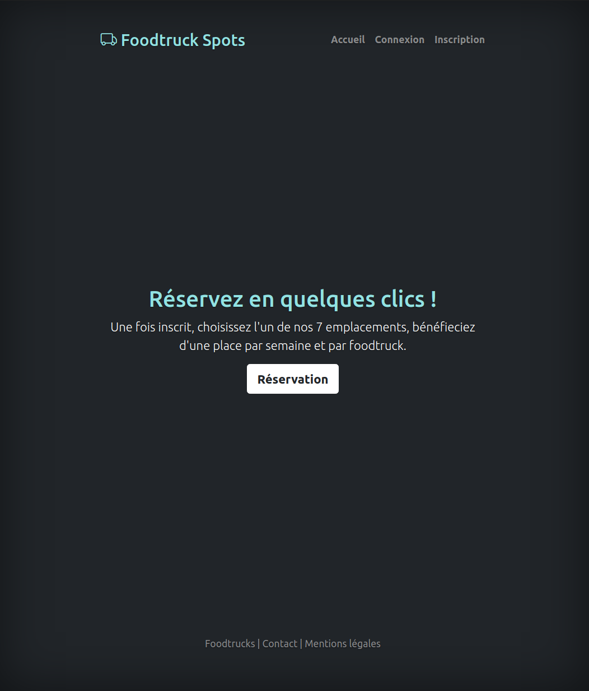
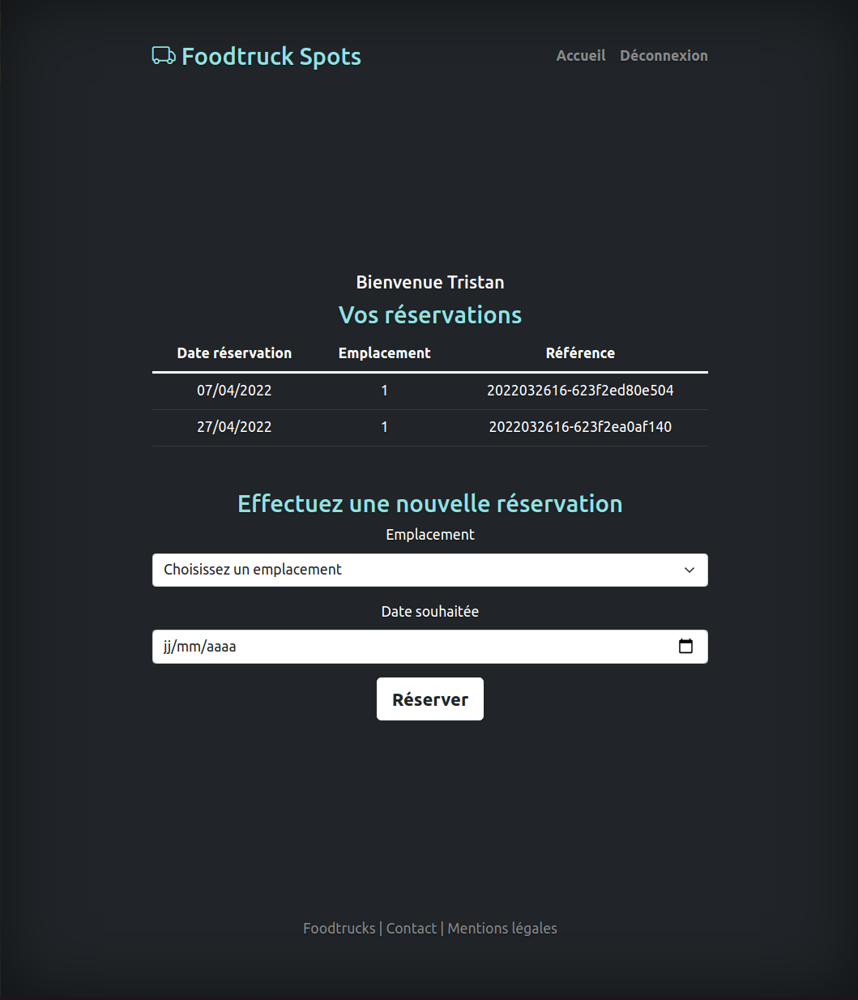

# Foodtruck Spot
Login and reserve your favorite spot for your foodtruck within few minutes !







## How to install

1. Install first the API repo : 
https://github.com/TristanBonnal/foodtruck-api.git

2. Launch php server on the API repo on port 8000 
   ```
   php -S localhost:8000 -t public
   ```

3. Launch php server on the front repo (this one) on a different port for exemple
    ```
    php -S localhost:8001 
    ```

4. Go to localhost:8001 on your browser


